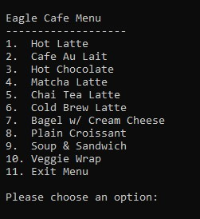
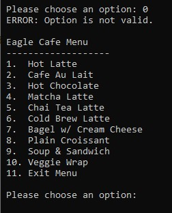
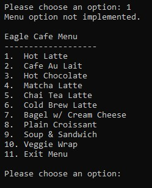
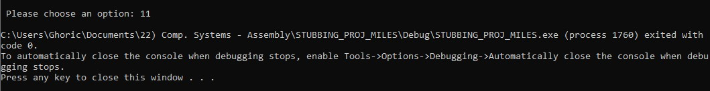

Stubbing Project

# Test results to document correct execution via output display.

This is what the menu looks like --> 

Error message after entering an invalid option --> 

Not Implemented message after entering valid option --> 

Program successfully exits upon entering exit input --> 

